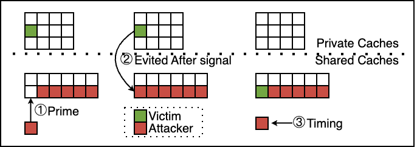
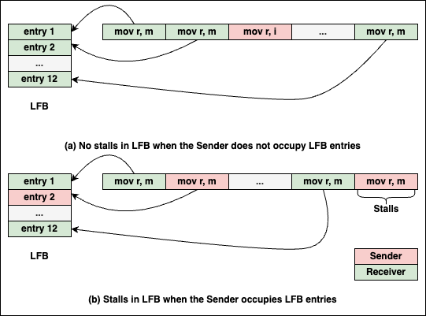

## <i class="fa fa-id-card" aria-hidden="true"></i> About Me ##

I am Han Wang, a Ph.D. student at the Southern University of Science and Technology (SUSTech), advised by Prof. Yinqian Zhang. I received my M.S. (advised by Prof. Ming Tang) and B.S. from the School of Cyber Science and Engineering, Wuhan University.

My research interests include CPU microarchitecture reverse engineering and the exploration of microarchitectural side-channel vulnerabilities. Specifically, I focus on analyzing the intricate behavior of modern processors, understanding their architectural design choices, and identifying potential security flaws.

## <i class="fa fa-fw fa-rss "></i> Recent News ##

<ul style="width: auto; height: 200px; overflow: auto">

<!-- <li> <b>2023/09</b>: Content. </li> -->

<li> <b>2025/09</b>: Joined <a href="https://yinqian.org/">Prof. Zhang's</a> lab at SUSTech. </li>

<li> <b>2025/06</b>: Graduated with a master's degree from the School of Cyber Science and Engineering, Wuhan University. </li>

<li> <b>2025/04</b>: I have been awarded the "Lei Jun Computer Breakthrough Scholarship" along with Ke Xu and Quancheng Wang. </li>

<li> <b>2022/06</b>: Graduated with a bachelor's degree from the School of Cyber Science and Engineering, Wuhan University. </li>

<li> <b>2021/11</b>: Joined <a href="https://cse.whu.edu.cn/info/1104/1798.htm">Prof. Tang's</a> lab at Wuhan University. </li>
  
</ul>

## <i class="fa fa-graduation-cap" aria-hidden="true"></i> Selected Publications ##

<table style="width: 100%; border-collapse: collapse; border: none;" border="0">
  <tr>
    <td style="width: 50%; vertical-align: top; padding-right: 20px; border: none;">
      
    </td>
    <td style="width: 50%; vertical-align: top; border: none;">
      <b>Han Wang</b>, Ming Tang, Quancheng Wang, Ke Xu, Yinqian Zhang. 
      "ZenLeak: Practical Last-Level Cache Side-Channel Attacks on AMD Zen Processors". 
      in <b>DAC 2025</b>. 
    </td>
  </tr>
  <tr>
    <td style="width: 50%; vertical-align: top; padding-right: 20px; border: none;">
      
    </td>
    <td style="width: 50%; vertical-align: top; border: none;">
      <b>Han Wang</b>, Ming Tang, Ke Xu, Quancheng Wang. 
      "Cache Bandwidth Contention Leaks Secrets". 
      in <b>DATE 2024</b>. 
      
      <a href="https://ieeexplore.ieee.org/abstract/document/10546529">PDF</a>
    </td>
  </tr>
</table>

